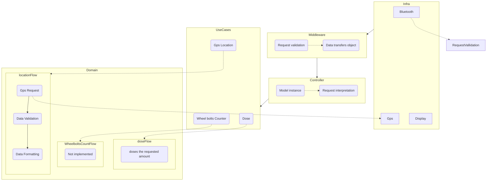

# CB5

<h2>Introduction</h2>

CB5 is the fifth version of an on-board computer device designed to be used on the mechanized poison dispensers from the company [Combate Serviços Florestais](https://www.google.com/search?client=safari&rls=en&q=combate+servicos+florestais&ie=UTF-8&oe=UTF-8). This device communicates via bluetooth with an android device. It provides GPS information to further processing and the possibility of applying doses of poison as required.

<h2>Technologies</h2>

- [Arduino]()
- [Platformio]()
- [C++]()
- [Bluetooth]()
- [ESP32]()

<h2>How to use</h2>

CB5 need to be used together with the CB android Application version 4 (CB4) or later. CB5 has an LCD display were it shows it's current state of operation besides errors information and it's bluetooth name to bluetooth connection. After Connected with the android device, simply follow the CB application instructions and feel free to use it!

<h2>Errors</h2>

| Code | Description | Cause |     |     |
| ---- | ----------- | ----- | --- | --- |
| 001  |             |       |     |     |
| 002  |             |       |     |     |
| 003  |             |       |     |     |

<h2> Communication Protocol </h2>

The bluetooth request will be interpreted as an string, which means that every byte will be decoded according to the ASCII table.

- ## Request

  The request is composed by N elements:

  | N   | Allowed characters | Description                                   |
  | --- | ------------------ | --------------------------------------------- |
  | 1   | I                  | Header                                        |
  | 2   | N                  | Header                                        |
  | 3   | F                  | Header                                        |
  | 4   | 0,1                | Alarm, "0" = OFF, "1" = ON                    |
  | 5   | N,0,2,...,9        | Doses, "N" = Don`t dose                       |
  | 6   | C,N                | Clear wheel bolts counter, "C" = YES "N" = NO |
  | 7   | x                  | extra character                               |
  | 8   | x                  | extra character                               |
  | 9   | x                  | extra character                               |
  | 10  | x                  | extra character                               |
  | 11  | x                  | extra character                               |
  | 12  | x                  | extra character                               |
  | 13  | x                  | extra character                               |
  | 14  | "CS"               | Check sum, sum form byte 4 to 14              |
  | 15  | "CR"               | 0x0D                                          |
  | 16  | "LF                | 0x0A                                          |

- ## Response

  The response is composed by N elements:  
  | N | Allowed characters | Description |
  | --- | ------------------ | ----------- |
  | 1 |& | Header |
  | 2 | 0,...,9| Wheel bolts count |
  | 3 | 0,...,9| Wheel bolts count|
  | 4 | S,E,B| Poison applicator status, "S" = Stand by, "B" = Busy, "E" = Error|
  | 5 | 0,..,9| Error code|
  | 6 | 0,..,9| Error code|
  | 7 | 0,..,9| Error code|
  | 8 | x|extra character |
  | 9 | x|extra character |
  | 10 | x|extra character |
  | 11 |CS|Check sum, form byte 2 to 10 |
  | 12 |,|GPS sentence separator |
  | 13...n |GPS|GPS Sentence |
  | 15 | "CR" | 0x0D |
  | 16 | "LF | 0x0A |

  ## GPS Sentence

  The GPS sentence is a slice from an GPRMC sentence.
  The sentence returned by the GPS should be similar to the following example: `$GPRMC,001220.00,A,3001.89425,S,05109.81024,W,0.374,,240719,,,N*75`. This sentence should be included in the CB response in this format: `001220.00,A,3001.89425,S,05109.81024,W,0.374,,240719,,,N75`

<h2> Code Architecture </h2>

The code architecture is divided in 6 different layers:

- ## Infra
  This is where all the external implementations were developed, such as:
  - GPS
  - LCD display
  - Logs
  - GPIO settings
- ## Middleware
  In this layer, all the request validation were implemented. All requests Should pass through this layer before processing.
- ## Controller
  In this layer the request is interpreted and the right use cases are executed.
- ## Use Case
  All domain orchestration are implemented in this layer.
- ## Domain
  All business rules are implemented in this layer.

